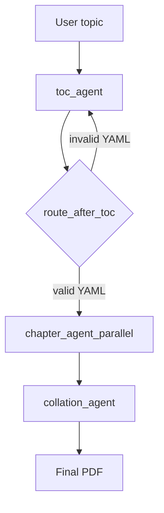

# Book Agent

Book Agent is a multi-agent workflow that generates a book from a single topic prompt. It creates a table of contents, expands each chapter in parallel, and collates the results into a final PDF.

This repository is built on top of `declarative-agent-sdk` and uses declarative YAML configuration plus skill-based agent behavior.

## Repository purpose

Given a topic such as `Artificial Intelligence for Product Managers`, the workflow will:

1. Generate a structured table of contents in YAML.
2. Expand each chapter into markdown content.
3. Compile the TOC and chapters into a single PDF.

## Workflow

The workflow is defined in `configs/agents/book_workflow.yaml` and wired in `agent_graph.py`.



## Available agents

### `toc_agent`

Purpose:
Create a valid YAML table of contents for the requested book topic.

Defined in:
- `toc_agent/agent.py`
- `toc_agent/configs/toc_agent.yaml`
- `skills/toc/SKILL.md`

Behavior:
- Receives the user topic from workflow state
- Produces YAML with chapter titles and subtopics
- Saves the result into the workspace
- Retries through `route_after_toc` if the YAML is invalid

Configured model and provider:
- Provider: `openai`
- Model: `gpt-5.4`

### `chapter_agent_parallel`

Purpose:
Generate all chapter drafts in parallel from the TOC output.

Defined in:
- `chapter_agent/agent.py`
- `chapter_agent/configs/chapter_agent.yaml`
- `skills/chapter/SKILL.md`

Behavior:
- Reads the TOC YAML generated by `toc_agent`
- Extracts chapter titles and subtopics
- Spawns one chapter-generation task per chapter
- Saves each chapter as a markdown file in `workspace/`

Configured model and provider:
- Provider: `openai`
- Model: `gpt-5.4`

Tools:
- `tavily_search`

### `collation_agent`

Purpose:
Compile the generated book into a single PDF.

Defined in:
- `collation_agent/agent.py`
- `collation_agent/configs/collation_agent.yaml`
- `skills/collation/SKILL.md`

Behavior:
- Receives chapter markdown file paths and the TOC file path
- Calls the `create_pdf_file` tool
- Saves the final PDF path into workflow state
- Writes the final PDF path to `workspace/collation_response.pdf`

Configured model and provider:
- Provider: `openai`
- Model: `gpt-5.4`

Tools:
- `create_pdf_file`

## Skills

The repository includes three skills under `skills/`:

- `skills/toc`: instructions for generating valid TOC YAML
- `skills/chapter`: instructions for writing chapter markdown
- `skills/collation`: instructions for building the final PDF

All skills are registered at startup through `SkillRegistry.register_all_from_directory()` in `agent_graph.py`.

## Repository layout

```text
book_agent/
    agent_graph.py
    agent_state.py
    main.py
    pyproject.toml
    run_agent.sh
    toc_agent/
        agent.py
        configs/
            toc_agent.yaml
    chapter_agent/
        agent.py
        configs/
            chapter_agent.yaml
    collation_agent/
        agent.py
        configs/
            collation_agent.yaml
    configs/
        agents/
            book_workflow.yaml
    skills/
        toc/
            SKILL.md
        chapter/
            SKILL.md
        collation/
            SKILL.md
            scripts/
                create_pdf_file.py
    workspace/
```

## Requirements

- Python 3.14+
- `uv`
- Access to the configured OpenAI-compatible endpoint
- Required API keys for any enabled search tools

## Installation

Install dependencies with `uv`:

```bash
uv sync
```

Project dependencies are declared in `pyproject.toml`, including the SDK dependency sourced from GitHub.

## Configuration

Agent and workflow configuration lives in YAML files:

- `configs/agents/book_workflow.yaml`: workflow topology
- `toc_agent/configs/toc_agent.yaml`: TOC agent config
- `chapter_agent/configs/chapter_agent.yaml`: chapter agent config
- `collation_agent/configs/collation_agent.yaml`: collation agent config

Current agent configs use:

- Provider: `openai`
- Model: `gpt-5.4`
- Endpoint URL: `http://mahadev-ms7d28:8000/v1`

## Running the agent

Start the workflow server:

```bash
uv run python -m agent_graph
```

Or use the helper script:

```bash
./run_agent.sh
```

The server starts on port `8000`.

## Running interactively

`agent_graph.py` includes an async `run_once()` helper for local interactive testing, but the default entrypoint starts the workflow server.

If you want to use the interactive loop instead of the server, switch the `__main__` section in `agent_graph.py` from `run_server()` to `asyncio.run(run_once())`.

## Outputs

Generated artifacts are written to `workspace/`.

Typical outputs include:

- TOC YAML file written by `toc_agent`
- One markdown file per generated chapter
- Final PDF file path stored as `workspace/collation_response.pdf`

The workflow stores intermediate results in state under `agents_output` and the final artifact path under `final_answer`.

## Notes

- The current implementation uses parallel chapter generation.
- There is no reviewer agent in the current workflow.
- `main.py` is not the workflow entrypoint; `agent_graph.py` is.
